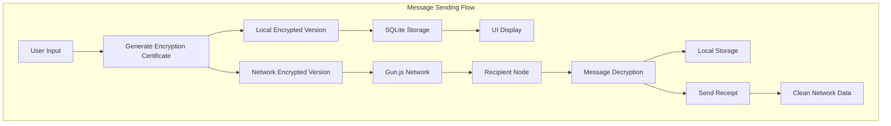
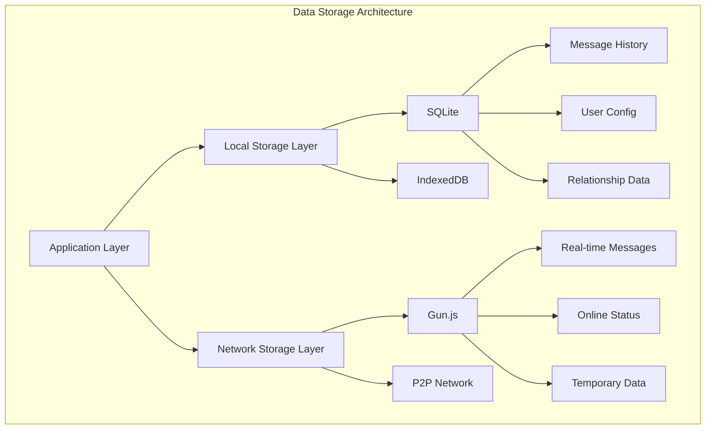
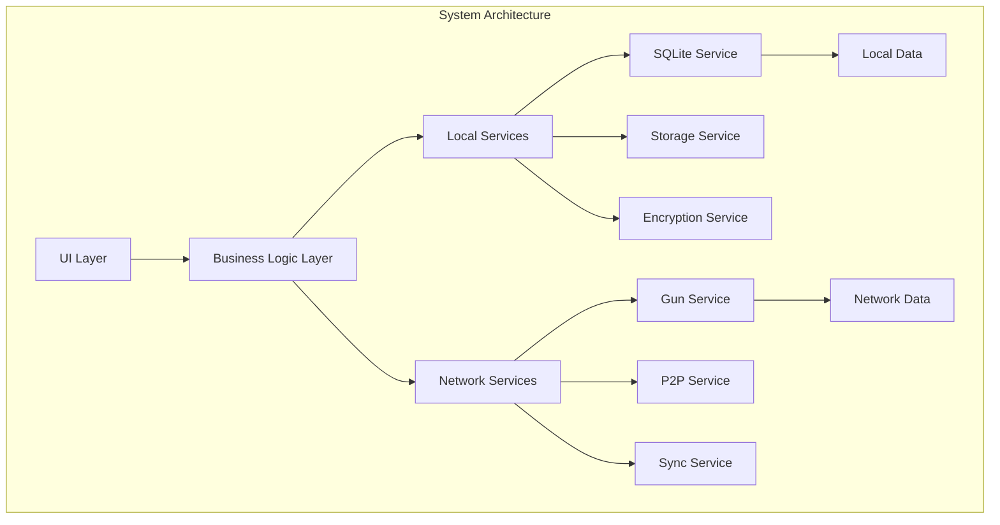

# Decentralized artificial intelligence application

What is TalkFlow?


1.Decentralized end-to-end encrypted chat application.

2.Decentralized artificial intelligence communication tools.

3.Decentralized general AI controller.

4.Decentralized Internet of Things controller.

5.Global decentralized distributed mesh communication network artificial intelligence data solution.

Decentralized artificial intelligence - robots - drones - communication facilities

# Design
We hope to use portable devices in our pockets to connect with the private artificial intelligence deployed at home anytime and anywhere. At the same time, our private artificial intelligence will help us solve everything. No matter where you are, Gun-Relay will provide you with powerful decentralized communication power.

We assume the design scenario of a controller. We use mobile devices to send a message to AI, which is to let our drone take off, circle the sky, and then fly to my position, while replying to the control coordinate list. At this time, the data of the intercepted coordinate field will be forwarded to the drone controller, such as List: y.1 x.3 y.9 x.2..... When the drone receives the coordinate list, it will perform tasks according to the coordinate data in the list. Eventually, it will fly to our position, but make sure that the battery is sufficient. All of this does not require cloud servers and cloud service APIs. You can also communicate without using the public network. We can run repeater broadcast hotspots on old computers and Android phones.

All processes maintain military encryption security standards. You can deploy the repeater by yourself and turn on the storage, and observe the changes of data in the store to confirm the security standards.

I modified it on the basis of Gun's design concept. It does not fully depend on the consensus mechanism. Instead, through Gun incremental snapshot data to the local independent form, block and block data are classified and archived through self-increasing keys. This will improve the performance of data indexing, because Gun is a graph database, which is sorted by msgId, which will encounter some trouble when the data volume is large and the data relationship is too complex. At the same time, further improve the stability of data. Sometimes the truth may be distorted, but we only trust private snapshot data. This is a friendly module for model training data. At the same time, you can easily migrate training data and address book chat records and other data. This is the design of point-to-point data. 

Channel data depends on Gun's powerful content addressing and multicast mechanism. This gives TalkFlow strong network self-healing capabilities and data recovery capabilities.

Modular as possible - repeater module - AI communication bridge module - basic chat application module - Internet of Things controller module

There are more! Forgive me for not more time to write a description! Because there are more designs that have not been completed!

If you're interested in our open source project story, please scroll down the page.

# Quick Start 

install ollama client
https://github.com/ollama/ollama

iOS:

AppStore:TalkFlow

https://apps.apple.com/us/app/talkflow/id6736827124

https://apps.apple.com/cn/app/talkflow/id6736827124

Android APK:

https://github.com/ponzS/TalkFlow/releases/tag/v1.0.0


MacOS&Windows client:

install dep
```base
yarn install
```
start
```base
yarn tauri dev
```
build the installation package
```base
yarn tauri build
```

Run Gun-Relay&Ollama

```base
cd gun-ollama
```
install dep
```base
yarn install
```
start
```base
node start.js
```


# composables
You only need to pay attention to the implementation of LisenChat and SentChat when expanding the controller.

```base
listenChat(pubKey: string)
const chatId = generateChatId(myPub, pubKey);
```

```base
sendChat(messageType: MessageType, payload: string | null = null, duration?: number)
```

# Used library

Vue

Vite

GunJs

Gun-Vue

Gun-Vue/relay

gun-avatar

OllamaJs

Tauri

capacitor

ionic

threeJs

cordova

ffmpeg

...

# Explanation of open source

I can't make all the artificial intelligence and Internet of Things controllers by myself. If you are interested in decentralized artificial intelligence tools, please submit PR. If TalkFlow is sponsored, all the funds obtained will be distributed equally to all TalkFlow contributors. The sponsor's avatar and name will be added to the iOS app and warehouse documents and our website. 
X:@GuoaiZ11355 

Thanks to Mark and Davay for their help and guidance. They are my teachers, my idols, and my best friends.

You can build any decentralized artificial intelligence application on the basis of this code warehouse. Of course, it would be better if you are willing to share your efforts with the open source community or submit PR! This will accelerate the development of decentralized forces!

# Basic core source

Gun DB

https://github.com/amark/gun

Created by Mark Nadal in 2014. More than ten years of testing and improvement. This includes the joint efforts of the Gun team contributors for more than 10 years.

Gun-Vue

https://github.com/DeFUCC/gun-vue

Created by Davay/Denis Starov. He spent four years researching on communication security and making stable basic components. The basic functions of TalkFlow are all modified from the basic components of Gun-Vue. Davay provided me with basic educational guidance and technical analysis. He is my teacher and my best friend. Thank you for Davay's help.

About Audio Stream and Media Stream Module

Created by Daniel Raeder. He doesn't agree with me sharing too much content. He created a completely new communication protocol and some new sci-fi features. That's all I can say, or he'll get angry. Hahaha, he has a bit of a temper, but he's a cool and kind person.


# About v1.5.6 Milestone and the Story of Our Open Source Project

So far, TalkFlow's development has consumed a year and a half of my time and quite a bit of money. This includes my living costs and the costs of project testing tools, etc.
But I'm now giving it away for free to all friends, just like Mark Nadal once gave Gunjs away to everyone.
Of course, Mark is a legend who created some interesting things, although sometimes he says strange things and does strange things.
And I'm just a small figure obsessed with freedom.

My name is ponz, but I always like to add an S. No other reason, just think it's cool. The name ponz was originally designed as an onomatopoeia, similar to the sound of a bullet being fired from the chamber of an AK47. The meaning includes critical moments and one-shot kills. I want to always be aware that the present moment is precious. You need to cherish every second to prepare for the moment when you will be fired from the chamber. I'm still waiting for that moment - I might hit an important target, or I might hit some unlucky person's car window. Interestingly, I had this name long before I knew about gunjs, so this might be some kind of destiny. In China, this is called fate.

Note: TalkFlow is developed based on Gunjs and gun-vue.

Additionally, I hope it can provide an extra option for autonomous communication for everyone. That is, if you want, you can use this repository at any time to build your own decentralized chat application and other designs, instead of having to use some monitored social and communication software in the app store. And it doesn't require you to rent cloud servers - it's completely decentralized. You can broadcast hotspots on any old laptop, or open your hotspot ports through Cloudflared's tunnel service, allowing people worldwide to use your node. Also, I need to emphasize that in the client design, the same user can connect to multiple nodes in parallel, not just one node like Wi-Fi. It's a truly decentralized mesh network design.


Why am I so obsessed with this open source project?

First, I believe private autonomous communication should be like humans transmitting information through air - it's a basic human right. It shouldn't be monitored, the keys must be in the users' own hands, and only yourself and those you allow can decrypt your data. In the design, if both parties receive receipt network data, it will be cleared, and if users switch peer nodes, the data pool will also transfer. Additionally, if a user engages in illegal activities causing consequences, they should be subject to legal sanctions. Any good or bad results and consequences caused by communication should be borne by or benefit the information creator.

I really hate when certain people who hold centralized system management rights use their rights to threaten and intimidate users and ordinary people. For example, "doxxing incidents".

However, I agree with content moderation in public channels because I don't want our children and friends to see meaningless content in public channels every day. Such moderation is reasonable and necessary. But for private communication, I hope it's absolutely free and absolutely autonomous - you don't need to rely on any company or institution long-term, even including carriers, to communicate and chat privately with friends.


Some issues I've encountered while promoting decentralized design:

If you plan to join the development of decentralization or power devolution technology, my experience might be helpful to you.

First, we need to know that some people still suffer from Stockholm Syndrome.

Stockholm Syndrome is a psychological phenomenon where victims develop emotional attachment or sympathy towards their captors, even cooperating with them, in kidnapping or captivity situations. This phenomenon usually occurs in long-term oppression or threat environments, where victims may gradually develop positive feelings towards their captors due to fear, dependence, or attempts to understand the captors' motives. The name comes from a 1973 bank robbery in Stockholm, Sweden, where hostages showed sympathy and support for the robbers.

If you encounter such people, they are not your target user group.
You should create private equipment for people who value privacy and data security.
Note: Some people's privacy isn't worth much, and they don't care about it themselves, so such people are not your target user group either.

About issues to note in international law:

Public channel information must have reliable monitoring measures and preparation, while private communication can safely delegate all power to users.

However, in some countries, you may need to note that they have strong regulatory requirements for their residents, including monitoring private communications. For your own personal safety, don't try to challenge a country by yourself unless you're Elon Musk. That's all I can tell you for now. If there are relevant constraints in a country's internal legislation, don't release your decentralized application in that country.

Davay once reminded me not to face everything alone. Everything exists for a reason - it will perish due to its own problems and be born due to some problems, ultimately reaching the best result.

Open source as much as possible, let all your users know how your application works, make them feel secure, and provide it to your users as intact as possible. Only open source can prove your application is reliable. Meanwhile, community developers might help you find problems and improve together.

I have another interesting friend named Mike who loves decentralized technology, including private AI running on decentralized networks. He often shares very useful articles and new technical data with us. This is also one of my motivations in the direction of decentralized AI tools. Mike gave me a lot of encouragement.

No company can afford global computing power consumption very cheaply, so it's necessary to distribute computing power demands to users themselves. I view current cloud service AI as a trial of the era. If you directly ask your users to spend a considerable amount of money to buy a computer, they will probably refuse. But after experiencing the power of real AI, they won't be able to live without it. Then one day when you tell them they can do all this on their own computer, with no ongoing financial expenditure, unlimited tokens, complete privacy, they will probably buy their own computer to run private AI and use their own data in a decentralized private network.

Daniel is also a very important friend of mine. He has been on this path of decentralization for over ten years. His GitHub repository has many tools you might find useful, including WebRTC tools and some communication protocols. He's also a rapper, and his music is interesting. LOL, just that his lyrics often contain swearing. Also, I'm working with him on another important decentralized project, which you might see soon - he's already bought the domain. But he often drinks, and when he drinks too much, he disappears. He has a cute cat. Daniel has started using TypeScript in his recent new project; he used to hate TypeScript.

Also, I want to say that in my own country, almost no one supports my project. There don't seem to be many people who care about autonomous communication and privacy security. But it doesn't matter - it's a non-profit open source project itself. If you need it, you can download the source code to build the package yourself, or directly download the release package. I now just need to ensure that my friends and I are not monitored and have freedom of speech.

Despite this, I still love my country - it was won with the lives and blood of countless Liberation Army soldiers, and today's peace didn't come easy. My country has many beautiful things: comfortable beaches, prosperous business districts, cafes opened by artists.

Of course, I've been to other countries too, and there are still many beautiful things and places. So I hate war and military oppression - all beauty is built on peace. I hope your projects are the same. Remember, peace comes first.

I will have many interesting projects later, such as drones and robots driven by decentralized networks, which will also be open source.
They will all be high-performance, low-latency, low-consumption, local-first, while ensuring data security.

Also, if you encounter bugs, please submit an issue or contact us on X. We also welcome your PR submissions.

My code style might be a bit messy in some modules - sometimes when I'm too focused on logic, I forget about zone management.
I accept any code style, as long as you ensure your code won't compromise system security and stability, then it's fine.
I will continue to update the story content here when I have time later. Thank you very much for reading this far.
TalkFlow V1.5.6 is for you.

# Project Structure and Technical Implementation

## Directory Structure
```
TalkFlow-Core/
├── src/                          # Source code directory
│   ├── App.vue                   # Root component
│   ├── main.ts                   # Application entry
│   ├── components/               # Components directory
│   │   ├── phone/               # Mobile components
│   │   │   ├── AiChatSimple.vue # AI chat simplified
│   │   │   ├── ChatS.vue        # Chat component
│   │   │   └── ...             # Other mobile components
│   │   ├── ipad/                # Tablet components
│   │   ├── tools/               # Utility components
│   │   ├── ui/                  # UI component library
│   │   └── window/              # Window control components
│   ├── composables/             # Vue composables
│   │   ├── TalkFlowCore.ts      # Core business logic
│   │   ├── useAIAutoReply.ts    # AI auto-reply
│   │   ├── useVoiceCall.ts      # Voice calls
│   │   └── ...                  # Other functional modules
│   ├── pages/                   # Page components
│   ├── services/                # Service layer
│   │   ├── sqliteService.ts     # SQLite database service
│   │   ├── storageService.ts    # Storage service
│   │   └── globalServices.ts    # Global services
│   ├── locales/                 # Internationalization
│   └── router/                  # Router configuration
├── src-tauri/                   # Tauri desktop config
├── public/                      # Static assets
├── capacitor.config.ts          # Capacitor config
├── vite.config.ts              # Vite build config
└── package.json                # Project dependencies
```

## Core Feature Implementation

### 1. Private Chat Message Implementation

Private chat messages use an innovative dual encryption and local-first strategy to ensure message security and transmission efficiency:

#### Message Sending Process
1. **Message Encryption**
   - Generate unique encryption certificate using sender's private key and receiver's public key
   - Encrypt messages with both parties' public keys, generating two versions
   - Local version: encrypted with sender's public key
   - Network version: encrypted with receiver's public key

2. **Local Storage**
   - Save local encrypted version to SQLite database
   - Immediately display message in UI (optimistic update)
   - Trigger send animation and haptic feedback

3. **Network Transmission**
   - Send network version to recipient via Gun.js
   - Message includes: encrypted content, timestamp, signature, message ID

4. **Reception Process**
   - Recipient decrypts message using private key
   - Saves decrypted message in local SQLite
   - Returns confirmation receipt to sender
   - Both parties delete network data upon receipt

5. **Data Cleanup**
   - Periodically clean confirmed delivered network data
   - Prevent Gun.js from re-syncing deleted data
   - Optimize network performance and storage space

### 2. Storage Architecture

#### Dual Storage System
1. **SQLite Local Storage**
   - Message history
   - User configurations
   - Friend relationship data
   - Group information

2. **Gun.js Network Storage**
   - Real-time message transmission
   - User online status
   - Temporary data sync
   - Multi-device data sync

#### Data Synchronization Strategy
- Local First: Prioritize SQLite data
- Incremental Sync: Only sync necessary updates
- Conflict Resolution: Use timestamps and version numbers
- Auto Recovery: Automatic reconnection after network interruption

### 3. Security Mechanism

#### End-to-End Encryption
- Based on Gun.SEA asymmetric encryption
- Individual message encryption
- Local key generation and storage
- Key backup and recovery support

#### Authentication
- Decentralized identity system
- Public key as user identifier
- Digital signature identity verification
- Multi-device key synchronization

### 4. Performance Optimization

#### Message Processing
- Message queue management
- Batch processing mechanism
- Smart retry strategy
- Automatic error recovery

#### UI Rendering
- Virtual scrolling
- Lazy image loading
- Animation performance optimization
- Background task processing

### 5. Cross-Platform Adaptation

#### Responsive Design
- Mobile-first
- Tablet optimization
- Desktop enhancement
- Unified user experience

#### Platform-Specific Features
- iOS keyboard adaptation
- Android notification optimization
- Desktop window management
- Web PWA support

## Technical Features

1. **Decentralized Architecture**
   - No central server dependency
   - P2P network communication
   - Distributed data storage
   - High availability design

2. **Security Design**
   - End-to-end encryption
   - Zero-knowledge proof
   - Forward secrecy
   - Key rotation mechanism

3. **Performance Optimization**
   - Local-first strategy
   - Incremental data sync
   - Smart caching mechanism
   - On-demand resource loading

4. **User Experience**
   - Instant response
   - Offline availability
   - Multi-device sync
   - Seamless switching

5. **Extensibility**
   - Modular design
   - Plugin system
   - API abstraction
   - Custom themes

# System Architecture Diagrams

## Message Sending Flow


## Data Storage Architecture


## Overall System Architecture


These architecture diagrams illustrate TalkFlow's core design principles:

1. **Message Sending Flow**
   - Shows the complete process from user input to final delivery
   - Highlights dual encryption and local-first approach
   - Clearly explains the data cleanup mechanism

2. **Data Storage Architecture**
   - Shows the layered design of the dual storage system
   - Clearly separates local and network storage responsibilities
   - Indicates storage locations for different types of data

3. **Overall System Architecture**
   - Shows the system's layered design
   - Clearly displays relationships between services
   - Emphasizes decoupling of local and network services


