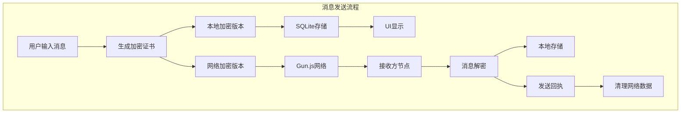
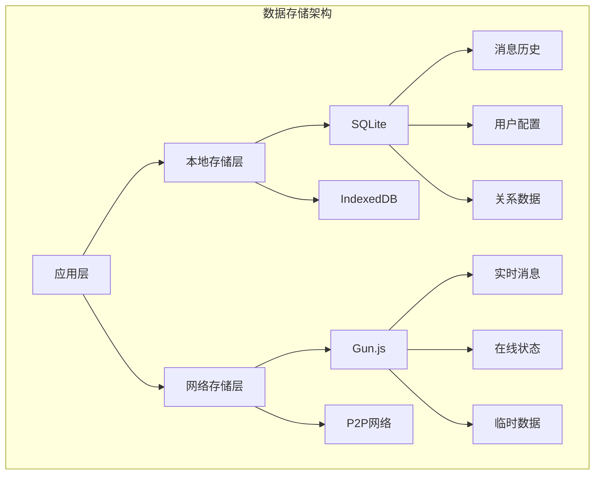
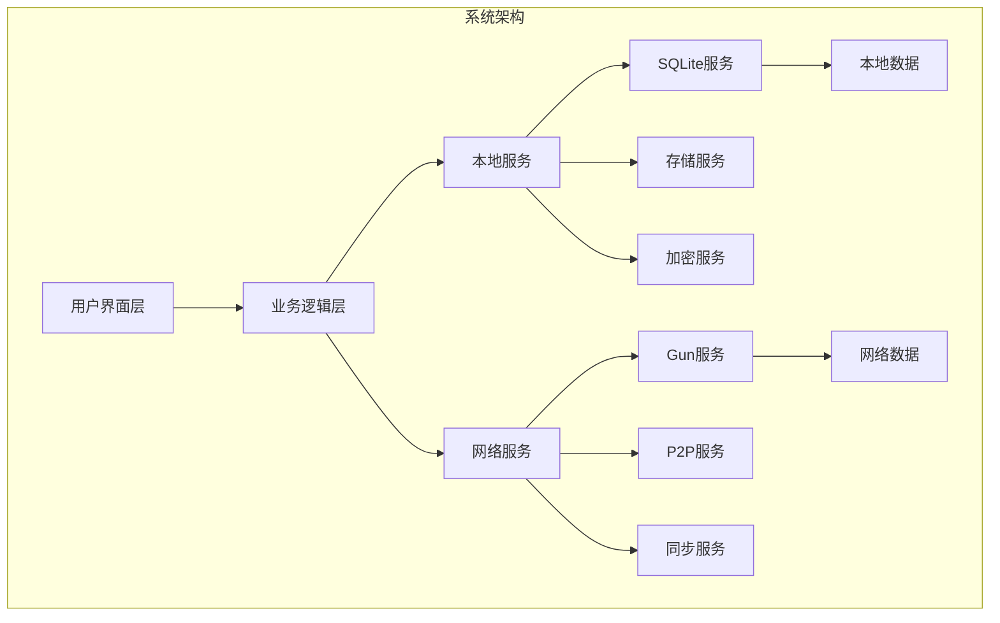

[English](README.md) | [简体中文](README.zh.md)


# 去中心化人工智能应用

什么是 TalkFlow？


1. 去中心化端到端加密聊天应用
2. 去中心化人工智能通信工具
3. 去中心化通用AI控制器
4. 去中心化物联网控制器
5. 全球去中心化分布式网状通信网络人工智能数据解决方案

去中心化人工智能 - 机器人 - 无人机 - 通信设施

# 设计理念
我们希望能够随时随地通过口袋中的便携设备连接家中部署的私人人工智能。同时，我们的私人人工智能将帮助我们解决一切问题。无论您身在何处，Gun-Relay都将为您提供强大的去中心化通信能力。

我们假设一个控制器的设计场景：我们使用移动设备向AI发送消息，让我们的无人机起飞、盘旋，然后飞到我的位置，同时回复控制坐标列表。此时，被拦截的坐标字段数据将被转发到无人机控制器，如List：y.1 x.3 y.9 x.2.....。当无人机收到坐标列表时，它将根据列表中的坐标数据执行任务。最终，它会飞到我们的位置，但要确保电池电量充足。所有这些都不需要云服务器和云服务API。您也可以在不使用公共网络的情况下进行通信。我们可以在旧电脑和Android手机上运行中继广播热点。

所有过程都保持军事加密安全标准。您可以自行部署中继器并开启存储，通过观察存储中数据的变化来确认安全标准。

我在Gun设计理念的基础上进行了修改。它不完全依赖于共识机制。相反，通过Gun增量快照数据到本地独立形式，通过自增键对块和块数据进行分类和归档。这将提高数据索引的性能，因为Gun是一个图数据库，按msgId排序，当数据量大且数据关系过于复杂时会遇到一些麻烦。同时进一步提高数据的稳定性。有时真相可能被扭曲，但我们只相信私有快照数据。这是一个对模型训练数据友好的模块。同时，您可以轻松迁移训练数据和通讯录聊天记录等数据。这是点对点数据的设计。

通道数据依赖于Gun强大的内容寻址和多播机制。这赋予了TalkFlow强大的网络自愈能力和数据恢复能力。

尽可能模块化 - 中继器模块 - AI通信桥接模块 - 基础聊天应用模块 - 物联网控制器模块

还有更多！请原谅我没有更多时间写描述！因为还有更多的设计尚未完成！

如果您对我们的开源项目故事感兴趣，请向下滚动页面。

# 快速开始

安装 Ollama 客户端
https://github.com/ollama/ollama

iOS版本：

AppStore：TalkFlow

https://apps.apple.com/us/app/talkflow/id6736827124

https://apps.apple.com/cn/app/talkflow/id6736827124

Android APK：

https://github.com/ponzS/TalkFlow/releases/tag/v1.0.0

MacOS和Windows客户端：

安装依赖
```base
yarn install
```
启动
```base
yarn tauri dev
```
构建安装包
```base
yarn tauri build
```

运行 Gun-Relay和Ollama

```base
cd gun-ollama
```
安装依赖
```base
yarn install
```
启动
```base
node start.js
```


# 组件说明
在扩展控制器时，您只需要关注LisenChat和SentChat的实现。

```base
listenChat(pubKey: string)
const chatId = generateChatId(myPub, pubKey);
```

```base
sendChat(messageType: MessageType, payload: string | null = null, duration?: number)
```

# 使用的库

Vue

Vite

GunJs

Gun-Vue

Gun-Vue/relay

gun-avatar

OllamaJs

Tauri

capacitor

ionic

threeJs

cordova

ffmpeg

...

# 开源说明

我不能独自完成所有的人工智能和物联网控制器。如果您对去中心化人工智能工具感兴趣，请提交PR。如果TalkFlow获得赞助，所有获得的资金将平均分配给所有TalkFlow贡献者。赞助者的头像和名字将被添加到iOS应用程序、仓库文档和我们的网站中。
X：@GuoaiZ11355

感谢Mark和Davay的帮助和指导。他们是我的老师、我的偶像和我最好的朋友。

您可以在这个代码仓库的基础上构建任何去中心化人工智能应用。当然，如果您愿意与开源社区分享您的努力或提交PR就更好了！这将加速去中心化力量的发展！

# 基础核心来源

Gun DB

https://github.com/amark/gun

由Mark Nadal于2014年创建。经过十多年的测试和改进。这包括Gun团队贡献者十多年的共同努力。

Gun-Vue

https://github.com/DeFUCC/gun-vue

由Davay/Denis Starov创建。他花了四年时间研究通信安全和制作稳定的基础组件。TalkFlow的基本功能都是从Gun-Vue的基础组件修改而来。Davay为我提供了基础教育指导和技术分析。他是我的老师和最好的朋友。感谢Davay的帮助。 

关于音频流和媒体流模块

由Daniel Raeder创建。他不同意我分享太多内容。 他创造了一个全新的通信协议和一些新的科幻功能。我只能说这么多，否则他会生气的。哈哈哈哈哈，他的脾气不是很好，但他是一个很酷而且很善良的人。 


# 关于v1.5.6版本的里程碑和开源项目的故事

到目前为止，TalkFlow的开发已经消耗了我一年半的时间和不少的钱。其中包括我的生活成本和项目的测试工具的成本等等。
但我现在将它免费赠送给所有的朋友，就像Mark Nadal曾经将Gunjs免费赠送给了所有人一样。
当然，Mark是一个传奇，它创造了一些有趣的东西，虽然有时他会说一些奇怪的话和一些奇怪的行为。
而我只是一个执着于自由的小人物。

我的名字是ponz，但我总是会喜欢加一个S。没有其他原因，只是觉得酷。ponz这个名字最初的设计中它是一个拟声词，类似AK47开火时子弹从枪膛中发射时的声音。其中的含义包括关键时刻和一击毙命，我希望自己时刻意识到此时此刻的时间是珍贵的。你要珍惜每一秒钟去准备你将要被从枪膛中发射的那一刻。我仍然在等待那个时刻，我可能会击中重要目标，也可能击中某个倒霉蛋的车窗。有趣的是，我是在知道gunjs的很久之前就叫这个名字，所以这可能是某种巧合。在中国这个叫命中注定。

补充：TalkFlow是基于Gunjs和gun-vue开发的。

另外我希望它能为所有人提供一份额外的自主通信选项，也就是说，如果你想，你可以随时使用这个仓库搭建自己的去中心化聊天应用程序和其他的设计。 而不是必须使用应用商店中一些受到监视的社交和通信软件。 而且它不需要你租用云服务器，它是完全去中心化的，你可以随便找一台老旧的笔记本电脑广播热点，或者是通过Cloudflared的隧道服务开放你的热点端口，让全世界的人都可以使用你的节点。另外有一点我需要强调，客户端的设计中同一个用户可以并行同步连接多个节点，而不是像Wi-Fi一样只能连接一个节点。它是真正的去中心化网状网络设计。


我为什么如此执着于这个开源项目？

首先我认为私人自主通信它应该和人类通过空气传播信息一样，是基本人权。它不该被监控，密钥必须在用户自己的手里，只有自己和自己允许的人可以解密自己的数据，在设计中，如果双方收到回执网络数据则会被清空，而且如果用户切换对等节点，那么数据池也会转移。另外如果某个用户从事违法行为造成了一些后果，他应该受到法律的制裁。因通信而造成的任何好或坏的结果和后果应该由信息制造者承担后果或者是获得利润。

我非常讨厌某些因为自己持有中心化系统管理权的人使用自己的权利来威胁和恐吓用户和一些普通人。例如"开盒事件"。

但我同意在公共频道中对内容进行监管，因为我不希望我们的孩子和我们的朋友每天在公共频道看到的都是没有营养的内容。这样的监管是合理的，而且是必要的。但私人通信我希望是绝对自由和绝对自主的，你不需要长期依赖任何公司或者机构，甚至包括运营商与朋友进行通信和私人聊天。


我在宣传去中心化设计时遇到的一些问题：

如果你打算加入去中心化或者是权力下放技术的发展，那么我的经历可能对你会有一些帮助。

首先，我们需要知道有一些人仍然患有斯德哥尔摩综合症。

斯德哥尔摩综合征（Stockholm Syndrome）是一种心理现象，指受害者在被绑架或俘虏的情况下，对加害者产生情感依附或同情，甚至与之合作。这种现象通常发生在长期的压迫或威胁环境中，受害者可能因恐惧、依赖或试图理解加害者的动机而逐渐对其产生好感。名称源于1973年瑞典斯德哥尔摩一起银行抢劫案， hostages 对劫匪表现出同情和支持。

如果你遇到这样的人，那么他们不是你的目标用户群体。
你应该为注重隐私和数据安全的人制造私人装备。
补充：有些人的隐私并不值钱，他们自己也并不在乎，那么这样的人也不是你的目标用户群体。

关于国际法律中需要注意的问题：

公共频道信息必须具备可靠的监管措施和准备，私人通信可以放心全部权力下放给用户。

但在某些国家你可能需要注意，他们对自己国家的居民拥有强烈的监管需求，包括私人通信的监控，为了你自己的人身安全，不要尝试靠你自己去挑战一个国家，除非你是elon musk。我目前只能和你说这么多，如果这个国家的内部法案中存在相关的约束，那么你不要把你的去中心化应用程序上架到这个国家。

Davay曾提醒过我，不要独自一人面对一切。一切事物都有它存在的理由，它会因自己的问题而消亡，也会因为一些问题而诞生，最终得到一个最好的结果。

尽可能的开源，让你的所有用户知道你的应用程序是如何工作的，让他们放心，尽可能的原封不动的提供给你的用户。 只有开源才能证明你的应用程序是可靠的。同时或许会有社区的开发者帮助你寻找问题，一起改进。

我还有一个有趣的朋友，他叫Mike，他热爱去中心化技术，包括在去中心化网络上运行的私人人工智能。他经常会分享给我们一些非常有用的文章和一些新的技术数据。 这也是我在去中心化人工智能工具这个方向的动力之一。Mike给了我很多鼓励。

没有任何一家公司能够非常廉价的承受全球的算力消耗，因此将算力需求分散到用户自身是有必要的。目前云服务中的AI我将它视为时代的试用。如果直接让你的用户花一笔不小的钱买一台电脑他大概率会拒绝。但是在享受过真正的AI带来的力量时，他会再也离不开，但突然有一天你告诉他你可以在自己的电脑上做到这一切，没有持续的资金支出，无限token，完全的私密，这时候他大概率会购买自己的电脑运行私人的人工智能，同时在去中心化的私人网络中使用自己的数据。

Daniel，他也是我非常重要的一个朋友。他在去中心化的这条路上已经走了十多年了。 他的GitHub代码仓库中有非常多你可能用得上的工具，包括WebRTC的工具和一些通信协议。他还是一个说唱歌手，他的音乐很有趣。lol，只是他的歌词里经常骂人。 另外我在和他一起进行另一个重要的去中心化的项目，也许在不久后你会看到，他已经购买了域名。 但他经常喝酒，喝多了之后会失踪。他有一只可爱的小猫。Daniel在他最近的新项目里开始使用TypeScript了，他以前讨厌TypeScript。

另外我想说在我自己的国家，几乎没有人支持我的项目。似乎没有太多人在乎自主通信和隐私安全。但无所谓，它本身就是一个非营利性的开源项目，如果你需要，你可以下载源代码自己构建安装包，或者是直接下载发行版安装包。我现在只需要确保我和我的朋友们不受任何监控，而且言论自由。

尽管如此，我仍然热爱自己的国家，它是由无数个解放军战士的生命和鲜血换来的，今天的和平来之不易。我的国家有很多美丽的事物，舒服的海边，繁华的商业区，某个艺术家开的咖啡馆。

当然我也去过其他的国家，仍然有很多美丽的事物和地方。所以我憎恨战争和军事打压，一切美好都建立在和平之上。希望你参与的项目也是如此。记住，和平第一。

我之后还会有由去中心化网络驱动的无人机和机器人等很多有趣的项目，同样会开源。
他们都将会高性能-低延迟-低消耗-本地优先，同时保障数据安全。

另外，如果你遇到bug请提交issue或者在x联系我们。同时也支持你提交PR。

我的部分模块中代码风格可能会比较混乱，有时候太专注于逻辑时会忘记分区管理。
我接受任何代码风格，只要确保你的代码不会破坏系统的安全性和稳定性，那么就没问题。
在之后有时间的时候我会继续更新这里的故事内容。非常感谢你看到这里。
TalkFlow V1.5.6送给你。

# 项目结构与技术实现

## 目录结构
```
TalkFlow-Core/
├── src/                          # 源代码目录
│   ├── App.vue                   # 根组件
│   ├── main.ts                   # 应用入口
│   ├── components/               # 组件目录
│   │   ├── phone/               # 手机端组件
│   │   │   ├── AiChatSimple.vue # AI聊天简化版
│   │   │   ├── ChatS.vue        # 聊天组件
│   │   │   └── ...             # 其他手机端组件
│   │   ├── ipad/                # 平板端组件
│   │   ├── tools/               # 工具组件
│   │   ├── ui/                  # UI组件库
│   │   └── window/              # 窗口控制组件
│   ├── composables/             # Vue组合式API
│   │   ├── TalkFlowCore.ts      # 核心业务逻辑
│   │   ├── useAIAutoReply.ts    # AI自动回复
│   │   ├── useVoiceCall.ts      # 语音通话
│   │   └── ...                  # 其他功能模块
│   ├── pages/                   # 页面组件
│   ├── services/                # 服务层
│   │   ├── sqliteService.ts     # SQLite数据库服务
│   │   ├── storageService.ts    # 存储服务
│   │   └── globalServices.ts    # 全局服务
│   ├── locales/                 # 国际化文件
│   └── router/                  # 路由配置
├── src-tauri/                   # Tauri桌面端配置
├── public/                      # 静态资源
├── capacitor.config.ts          # Capacitor配置
├── vite.config.ts              # Vite构建配置
└── package.json                # 项目依赖
```

## 核心功能实现

### 1. 私聊消息实现机制

私聊消息采用创新的双重加密和本地优先策略，确保了消息的安全性和传输效率：

#### 消息发送流程
1. **消息加密**
   - 使用发送方私钥和接收方公钥生成唯一的加密证书
   - 消息分别用双方的公钥进行加密，生成两个版本
   - 本地版本：使用发送方公钥加密
   - 网络版本：使用接收方公钥加密

2. **本地存储**
   - 将本地加密版本保存到SQLite数据库
   - 消息立即显示在UI上（乐观更新）
   - 触发发送动画和震动反馈

3. **网络传输**
   - 通过Gun.js将网络版本发送给接收方
   - 消息包含：加密内容、时间戳、签名、消息ID

4. **接收流程**
   - 接收方收到消息后使用私钥解密
   - 在本地SQLite中保存解密后的消息
   - 向发送方返回确认回执
   - 双方收到回执后删除网络数据

5. **数据清理**
   - 定期清理已确认送达的网络数据
   - 避免Gun.js重新同步已删除的数据
   - 优化网络性能和存储空间

### 2. 存储架构

#### 双重存储系统
1. **SQLite本地存储**
   - 消息历史记录
   - 用户配置信息
   - 好友关系数据
   - 群组信息

2. **Gun.js网络存储**
   - 实时消息传输
   - 用户在线状态
   - 临时数据同步
   - 多设备数据同步

#### 数据同步策略
- 本地优先：优先使用SQLite数据
- 增量同步：只同步必要的更新
- 冲突解决：使用时间戳和版本号
- 自动恢复：网络中断后自动重连

### 3. 安全机制

#### 端到端加密
- 基于Gun.SEA的非对称加密
- 每个消息独立加密
- 密钥本地生成和存储
- 支持密钥备份和恢复

#### 身份验证
- 去中心化身份系统
- 公钥作为用户标识
- 数字签名验证身份
- 多设备密钥同步

### 4. 性能优化

#### 消息处理
- 消息队列管理
- 批量处理机制
- 智能重试策略
- 错误自动恢复

#### UI渲染
- 虚拟滚动
- 懒加载图片
- 动画性能优化
- 后台任务处理

### 5. 跨平台适配

#### 响应式设计
- 移动端优先
- 平板电脑适配
- 桌面端增强
- 统一用户体验

#### 平台特定功能
- iOS键盘适配
- Android通知优化
- 桌面端窗口管理
- Web端PWA支持

## 技术特点

1. **去中心化架构**
   - 无中心服务器依赖
   - P2P网络通信
   - 分布式数据存储
   - 高可用性设计

2. **安全性设计**
   - 端到端加密
   - 零知识证明
   - 前向安全性
   - 密钥轮换机制

3. **性能优化**
   - 本地优先策略
   - 增量数据同步
   - 智能缓存机制
   - 资源按需加载

4. **用户体验**
   - 即时响应
   - 离线可用
   - 多设备同步
   - 无缝切换

5. **可扩展性**
   - 模块化设计
   - 插件系统
   - API抽象
   - 自定义主题

# 系统架构图解

## 消息发送流程


## 数据存储架构


## 系统整体架构


这些架构图展示了TalkFlow的核心设计理念：

1. **消息发送流程**
   - 展示了从用户输入到最终送达的完整流程
   - 突出显示了双重加密和本地优先的特点
   - 清晰说明了数据清理机制

2. **数据存储架构**
   - 展示了双重存储系统的分层设计
   - 清晰划分了本地存储和网络存储的职责
   - 说明了不同类型数据的存储位置

3. **系统整体架构**
   - 展示了系统的分层设计
   - 清晰显示了各个服务之间的关系
   - 突出了本地服务和网络服务的解耦